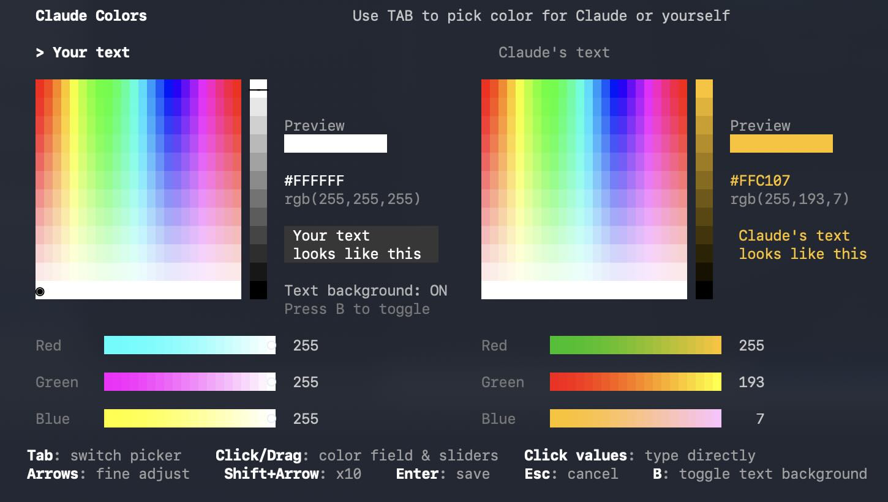

# Claude Code Conversation Colors

Customize the text colors in your Claude Code conversations. Pick one color for your text and a different color for Claude's text so you can instantly tell who said what. Works on macOS, Linux, and Windows.



## Why claude-colors?

- **Survives Claude Code updates** — no patching, no hacking internals, nothing to break
- **Terminal-level color control** — works with Claude Code's own rendering, not against it
- **Zero dependencies** — single binary, no npm packages, no config files to manage
- **One command to reapply** — if an update resets your colors, `claude-colors --reapply` restores them instantly

## What it does

- Visual color picker to customize your text color and Claude's text color independently
- Applies colors automatically — open a new terminal tab and they're live
- Toggle the gray message background on or off
- Settings persist across all new Claude Code sessions
- Rerun anytime to change your conversation colors

## Install

### macOS / Linux (curl)

```bash
curl -fsSL https://raw.githubusercontent.com/ProducerGuy/claude-code-conversation-colors/main/install.sh | sh
```

### macOS (Homebrew)

```bash
brew tap ProducerGuy/claude-code-conversation-colors
brew install claude-colors
```

### Manual download

Download the binary for your platform from [Releases](https://github.com/ProducerGuy/claude-code-conversation-colors/releases):

| Platform | Binary |
|----------|--------|
| Mac (Apple Silicon) | `claude-colors-macos-arm64` |
| Mac (Intel) | `claude-colors-macos-x64` |
| Linux (x64) | `claude-colors-linux-x64` |
| Windows (x64) | `claude-colors-windows-x64.exe` |

After downloading:

```bash
chmod +x claude-colors-macos-arm64
./claude-colors-macos-arm64
```

## Usage

Run the tool:

```bash
claude-colors
```

A color picker opens with two panels — one for your text, one for Claude's text. Click or drag the color field, adjust the RGB sliders, or click the values to type them directly. Press `B` to toggle the gray background behind your messages. Press `Enter` to save.

Open a new terminal tab and start Claude Code to see your colors.

## Change your conversation colors

Run `claude-colors` again. Your current colors load automatically. Pick new ones and hit Enter.

## Reset to default Claude Code colors

```bash
claude-colors --uninstall
```

This restores everything to the original Claude Code colors:
- Your text color returns to white
- Claude's text color returns to white
- The gray background behind your messages is restored
- All saved color settings are removed

## Reapply colors after a Claude Code update

Your colors are designed to survive Claude Code updates. If an update ever does reset them, just run:

```bash
claude-colors --reapply
```

Your saved colors are applied again instantly. No reinstall, no reconfiguration.

## Supported platforms

- macOS (Apple Silicon and Intel)
- Linux (x64)
- Windows (x64)

Requires Claude Code installed via npm.

## License

MIT
